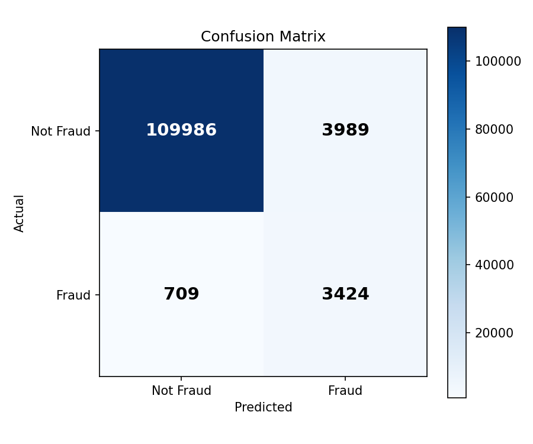
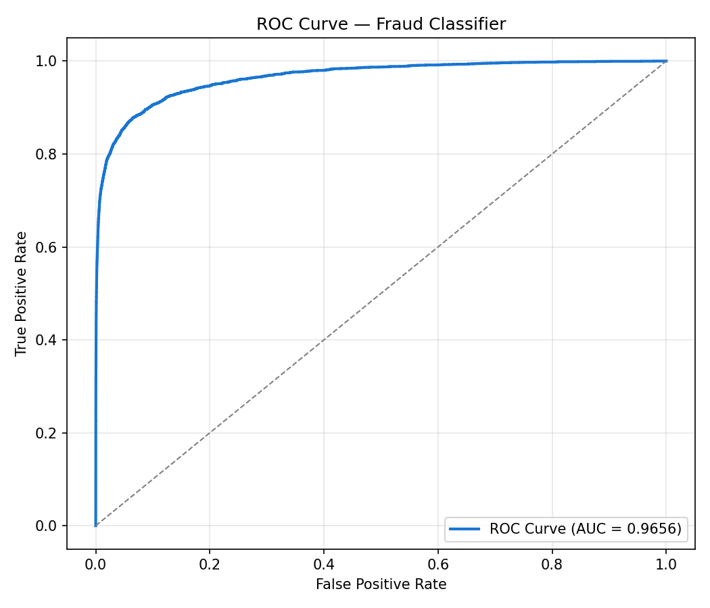

# Self-Healing Fraud Detection Pipeline

> Real-time fraud detection with automated data drift monitoring - the pipeline knows when to stop trusting itself.

## Overview

Most fraud detection systems have a critical blind spot: they assume incoming data is always clean. When data drift occurs (schema changes, corrupted features, distribution shifts), ML models silently degrade and continue making wrong predictions - undetected until fraud spikes.

This project solves that problem with a **self-healing architecture**: a secondary ML model continuously monitors incoming data health before it reaches the fraud classifier. If drift is detected, the pipeline halts automatically and alerts the engineer.

## Live Demo

- **API Docs:** [FastAPI Swagger UI](http://40.65.88.4:8000/docs)

---

## Architecture
```
                    IEEE-CIS Dataset (590K transactions)
                               │
                               ▼
                      ┌─────────────────┐
                      │  Kafka Producer  │
                      │ (real-time feed) │
                      └────────┬────────┘
                               │
                               ▼
                  ┌────────────────────────┐
                  │    Layer 1             │
                  │   Isolation Forest     │
                  │  "Is data healthy?"    │
                  └──────┬─────────────────┘
                         │
              ┌──────────┴──────────┐
              │                     │
           Healthy               Drifted
              │                     │
              ▼                     ▼
   ┌─────────────────┐    ┌──────────────────┐
   │   Layer 2       │    │  AUTO-HALT       │
   │   XGBoost       │    │  + Email Alert   │
   │ Fraud Classifier│    └──────────────────┘
   └────────┬────────┘
            │
            ▼
       ┌─────────┐
       │  AWS S3 │ (data lake)
       └────┬────┘
            │
            ▼
    ┌──────────────┐
    │   Airflow    │ (hourly DAG orchestration)
    └──────┬───────┘
           │
           ▼
       ┌───────┐
       │  dbt  │ (staging → intermediate → marts)
       └───┬───┘
           │
           ▼
    ┌────────────┐
    │  Snowflake │ (analytics warehouse)
    └────────────┘
```

---

## Key Results

| Metric | Value |
|---|---|
| Dataset | IEEE-CIS Fraud Detection (590K transactions) |
| Features Used | **154** (transaction + identity + engineered) |
| Fraud Classifier F1 | **0.59** |
| Fraud Classifier Recall | **0.83** - catches 83% of real fraud |
| Fraud Classifier ROC-AUC | **0.9656** |
| Drift Detection | **100/100** injected anomalies caught |
| Pipeline Response | **Auto-halt** within one batch on drift |
| Throughput | 100 transactions/batch, real-time |

> High recall (0.83) is intentional - in fraud detection, missing real fraud is more costly than false positives.




---

## Tech Stack

| Layer | Technology |
|---|---|
| Streaming | Apache Kafka |
| Drift Detection | Isolation Forest (Scikit-learn) |
| Fraud Classification | XGBoost |
| Model Serving | FastAPI |
| Orchestration | Apache Airflow |
| Transformation | dbt (staging → marts) |
| Warehouse | Snowflake |
| Cloud Deployment | Azure VM (B2ats_v2) |
| Infrastructure | Docker + Docker Compose |

---

## What Makes This Different

| Traditional Fraud Pipeline | This System |
|---|---|
| Detects fraud | Detects fraud + monitors data health |
| Fails silently on bad data | Halts automatically on drift |
| Engineer finds out hours later | Engineer alerted immediately |
| No self-awareness | MLOps-aware architecture |

---

## Project Structure
```
self-healing-fraud-pipeline/
├── kafka/                  # Producer and consumer
│   ├── producer.py
│   └── consumer.py
├── spark/                  # Feature extraction + drift injection
│   ├── stream_processor.py
│   └── drift_injector.py
├── models/
│   ├── drift_detector/     # Isolation Forest
│   │   ├── train.py
│   │   └── predict.py
│   ├── fraud_classifier/   # XGBoost
│   │   ├── train.py
│   │   ├── train_v2.py
│   │   └── predict.py
│   └── serving/            # FastAPI model server
│       └── api.py
├── pipeline/               # End-to-end runner
│   └── run_pipeline.py
├── airflow/dags/           # Airflow DAG
├── dbt/models/             # Staging, intermediate, marts
├── alerts/                 # Email alert system
└── docs/                   # Architecture, metrics, charts
```

---

## Setup & Run

### Prerequisites
- Docker Desktop
- Python 3.10+
- Kaggle account (for dataset)

### Steps
```bash
# 1. Clone repo
git clone https://github.com/19121A05A4/self-healing-fraud-pipeline.git
cd self-healing-fraud-pipeline

# 2. Download IEEE-CIS dataset from Kaggle into data/
# https://www.kaggle.com/c/ieee-fraud-detection/data

# 3. Start infrastructure
docker-compose up -d
docker-compose -f docker-compose-airflow.yaml up -d

# 4. Setup Python environment
python -m venv venv && venv\Scripts\activate
pip install -r requirements.txt

# 5. Train models
python models/drift_detector/train.py
python models/fraud_classifier/train_v2.py

# 6. Run the pipeline
python pipeline/run_pipeline.py

# 7. Simulate data drift (in new terminal)
python spark/drift_injector.py
```

### Expected Output
```
--- Processing batch of 100 transactions ---
Drift check: score=0.3459, healthy=True
Fraud check: 11 fraudulent transactions detected
Result: {'status': 'OK', 'fraud_count': 11}

--- Processing batch of 100 transactions ---
Drift check: score=-0.1758, healthy=False
🚨 DATA DRIFT DETECTED - Halting pipeline!
[ALERT] Anomaly Score: -0.1758
[ALERT] Anomalies: 100/100 records
Pipeline halted due to drift. Restart after investigating.
```

---

## Limitations

- Drift detection monitors feature distribution changes (covariate shift) — does not detect concept drift or automatically retrain the model on new data
- Model retraining on drift is manual — engineer must intervene after pipeline halts

## Future Work

- Automated model retraining triggered on drift detection
- Concept drift monitoring using prediction confidence scores
- SHAP explainability layer for fraud predictions
- Prometheus + Grafana metrics dashboard
- Kaggle IEEE-CIS leaderboard submission
```

---
